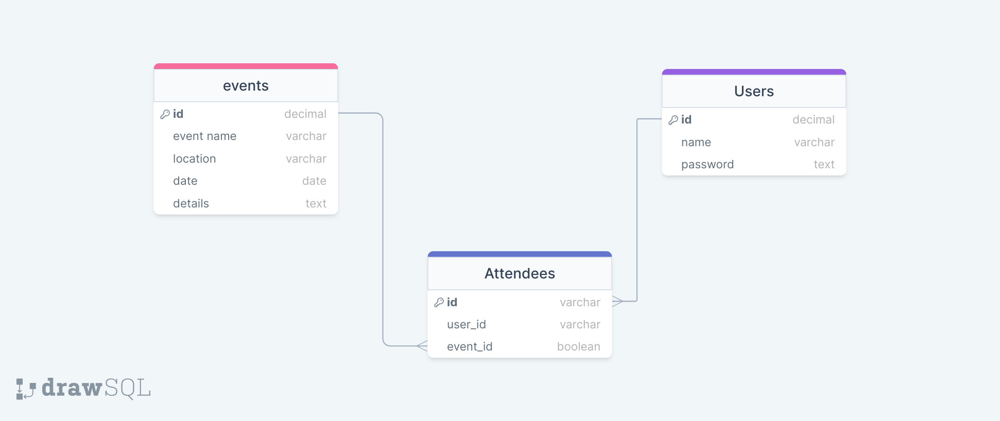

# Event-planner

## ✧ The Description of project:
This app allows users to create and manage events. Users can create new events by specifying the event name, date, time, location, and other details. They can view a list of their created events and manage them by editing event details or deleting events.

## ✧ User Story:
* I can add Login as admin
* I can create event
* I can delete event
* I can modify event
* # and as a User:
    * I can show all event
    * I can request to attend to event

## ✧ We are start the project with this Database Schema

## ✧ Tech used:
- HTML
- CSS
- Java script
- Node Js 
- Express JS
- postgreSQL
- Git & Github

## ✧ Features:
* Create new events with name, date, time, location, and other details
* Edit or delete existing events
* Send email invitations to attendees

## ✧ User Story:

## ✧ Future Improvements:
* Add user authentication and authorization
* Allow attendees to add events to their calendar
* Provide more customization options for event invitations

## Team members:
* [Eman Alabsi](https://github.com/Emanalabsi)
* [Momen Marwan](https://github.com/momenmarwan)
